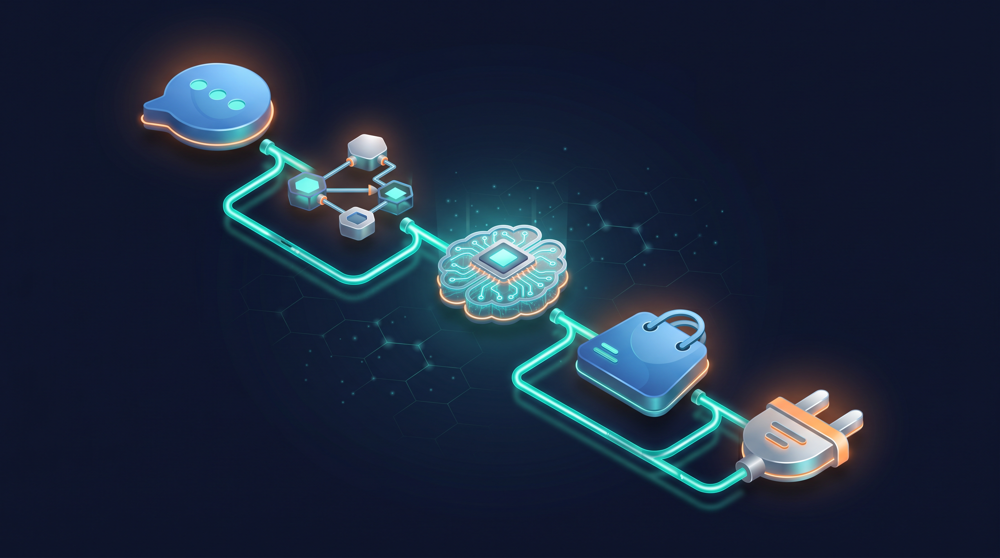
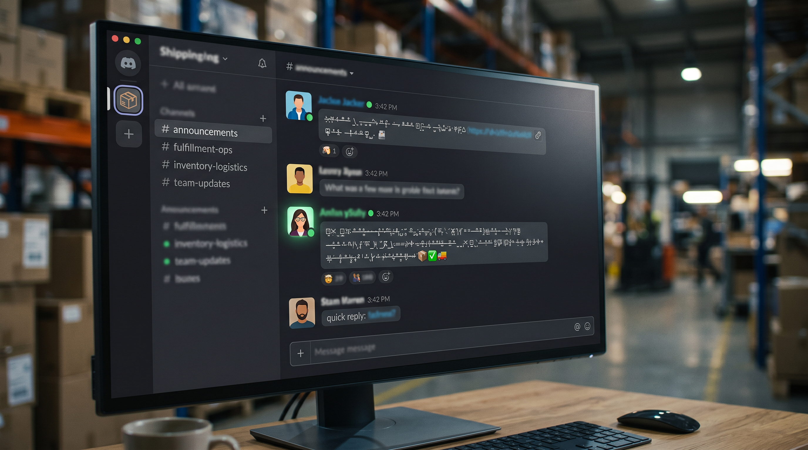
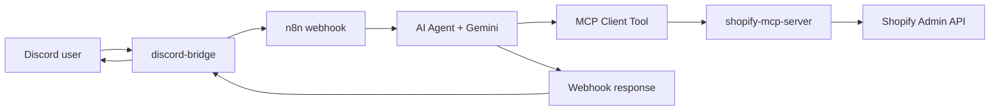

# Shopify Discord Agent

[](https://github.com/Ai-assistant-KIRA/shopify-discord-agent/actions/workflows/test.yml)
[](LICENSE)
[](package.json)

**Ask your Shopify store questions in Discord.** Type what you need — stock levels, today's revenue, order status, discount codes — and get live answers without opening the admin.

Built with **Discord**, **n8n**, **Google Gemini (Vertex AI)**, and a custom **MCP tool server** that wraps the Shopify Admin GraphQL API.

### Why I built this

- **Problem** — E-commerce ops teams live in Discord, but every stock check or revenue question meant opening Shopify admin.
- **Approach** — Expose Shopify as typed MCP tools (not brittle n8n HTTP nodes) and let Gemini pick the right action via an n8n AI Agent.
- **Outcome** — 28 tools, mock mode for zero-credential demos, and a CONFIRM gate on high-risk writes so the agent can act safely in production chat.

<p align="center">
  
</p>

<p align="center">
  <a href="#quick-start-docker"><strong>Quick start</strong></a> ·
  <a href="#demo-video">Demo</a> ·
  <a href="#what-it-does">Features</a> ·
  <a href="#architecture">Architecture</a> ·
  <a href="docs/n8n-setup.md">n8n setup</a> ·
  <a href="docs/docker-setup.md">Docker guide</a>
</p>

---

## Demo video

https://github.com/Ai-assistant-KIRA/shopify-discord-agent/assets/main/assets/demo.mp4

*Discord → n8n → Gemini → MCP → Shopify Admin API in one conversational flow.*

---

## Quick start (Docker)

**One-time setup** — credentials are saved to `config/.env` and loaded on every start (permanent across restarts):

```bash
git clone https://github.com/Ai-assistant-KIRA/shopify-discord-agent.git
cd shopify-discord-agent
npm install
npm run setup          # once: Shopify + Discord credentials → config/.env
npm run docker:up      # starts stack; auto-restarts on reboot
```

Then (first launch only):

1. Open **http://localhost:5678** and create your n8n account
2. Import **`n8n-workflows/discord-shopify-mcp-agent.docker.json`**
3. Add **Google Vertex** credentials and set your GCP project ID in the Chat Model node
4. **Activate** the workflow
5. Message your bot in Discord

Vertex credentials are also saved once — they persist in the n8n Docker volume.

Guides: [n8n workflow setup](docs/n8n-setup.md) (local + cloud) · [Docker walkthrough](docs/docker-setup.md) · [Shopify credentials](docs/shopify-setup.md)

### Mock demo (no Shopify store)

```bash
npm run setup          # choose mock mode when prompted
npm run docker:mock
```

### Enable write tools later

Edit `config/.env` and set `SHOPIFY_READ_ONLY=false`, then `docker compose restart mcp`.

---

## What it does

Your team stays in Discord. The agent handles the Shopify lookups and actions.

| Category | Examples |
|----------|----------|
| **Inventory** | Stock by SKU, low-stock alerts, quantity updates |
| **Orders** | Search, daily list, fulfillment status, cancel, refund |
| **Revenue** | Today, yesterday, last 7/30 days |
| **Products** | Search catalog, list variants, pricing, publish/draft |
| **Discounts** | Create codes, list active promos, deactivate |
| **Draft orders** | Create, list, send invoices |
| **Customers** | Search, order history |
| **Carts** | Abandoned checkout summary |

**28 MCP tools** in full write mode. Read-only mode hides write tools for safe demos.

<p align="center">
  
</p>

### Example prompts

```
What's the stock for BB-TONER-200?
How much revenue did we make today?
Show unfulfilled orders from this week
Create a 15% code MUGWORT15 for the toner collection
Draft order for jane@example.com — 2x BB-TONER-200
Which products are below 10 units?
```

<p align="center">
  
</p>

---

## Architecture



| Layer | Role |
|-------|------|
| **Discord bridge** | Forwards channel messages to n8n; posts replies back |
| **n8n workflow** | LangChain AI Agent with per-channel memory |
| **Gemini (Vertex)** | Understands intent, picks tools, formats answers |
| **MCP server** | 28 typed tools over SSE — inventory, orders, discounts, etc. |
| **Shopify** | Live Admin GraphQL (or mock data for demos) |

Details: [docs/architecture.md](docs/architecture.md)

---

## Safety

High-risk writes (inventory changes, fulfillments, refunds, price updates) return a **CONFIRM** token. The agent waits for explicit approval before executing.

- `SHOPIFY_READ_ONLY=true` — hides all write tools
- `SHOPIFY_MOCK_MODE=true` — sample data, zero Shopify credentials needed

---

## Project layout

```
shopify-discord-agent/
├── config/                  # Permanent credentials (config/.env — created by npm run setup)
├── assets/                  # Demo video + README images
├── docs/                    # Setup guides (incl. n8n local + cloud)
├── lib/                     # Shopify client, tool registry, mock data
├── n8n-workflows/           # Importable workflow JSON
├── scripts/
│   ├── discord-bridge.mjs   # Discord ↔ n8n
│   ├── import-workflow.mjs
│   └── verify-shopify-creds.mjs
├── tests/                   # MCP integration tests
├── tools/                   # MCP tool modules (28 tools)
├── docker-compose.yml
├── shopify-mcp-server.mjs
└── README.md
```

---

## Local development (no Docker)

```bash
npm install
cp .env.example .env
npm run mcp:mock          # terminal 1 — MCP on :3000
npx n8n start             # terminal 2 — n8n on :5678
```

Import `n8n-workflows/discord-shopify-mcp-agent.json`, configure Vertex, activate, then:

```bash
npm run bridge            # terminal 3 — Discord listener
```

Health check: [http://localhost:3000/health](http://localhost:3000/health)

For **n8n Cloud**, the MCP server must be on a public HTTPS URL — see [docs/n8n-setup.md](docs/n8n-setup.md).

---

## Setup guides

- [n8n workflow](docs/n8n-setup.md) — local self-hosted and n8n Cloud
- [Docker Compose](docs/docker-setup.md) — recommended one-command stack
- [Discord bot](docs/discord-setup.md) — token, intents, channel setup
- [Shopify credentials](docs/shopify-setup.md) — dev store + Admin API token
- [Architecture](docs/architecture.md) — tools, safety tiers, data flow

---

## Environment variables

| Variable | Default | Purpose |
|----------|---------|---------|
| `SHOPIFY_MOCK_MODE` | `true` | Sample data instead of live API |
| `SHOPIFY_READ_ONLY` | `true` | Hide write tools |
| `SHOPIFY_DOMAIN` | — | Shopify store domain |
| `SHOPIFY_ACCESS_TOKEN` | — | Admin API token (`shpat_…`) |
| `DISCORD_BOT_TOKEN` | — | Bot token for the bridge |
| `N8N_WEBHOOK_URL` | `http://localhost:5678/webhook/discord` | Production webhook |
| `PORT` | `3000` | MCP server port |

---

## npm scripts

| Command | What it does |
|---------|--------------|
| `npm run setup` | One-time credential wizard → `config/.env` |
| `npm run docker:mock` | Start full stack with mock Shopify |
| `npm run docker:up` | Start stack with live Shopify |
| `npm run mcp:mock` | MCP server only (mock) |
| `npm run bridge` | Discord → n8n bridge |
| `npm run verify:shopify` | Test API credentials |
| `npm test` | MCP integration tests |

---

## Prerequisites

- **Node.js 20+**
- **Docker** (for the one-command setup)
- **Discord bot** with Message Content intent
- **Google Cloud** project with Vertex AI (Gemini)
- **Shopify dev store** (optional — mock mode works without it)

---

## Troubleshooting

| Issue | Fix |
|-------|-----|
| No Discord reply | Workflow must be **Active**; check `npm run bridge` logs |
| MCP errors | `curl localhost:3000/health` — start MCP with `npm run mcp:mock` |
| Shopify 401 | Use Admin API token (`shpat_`), not session token |
| Webhook 404 | Activate workflow or check webhook path |
| Vertex errors | Set GCP project ID in the Chat Model node |

---

## License

MIT — see [LICENSE](LICENSE).

---

<p align="center">
  <strong>Built by <a href="https://www.linkedin.com/in/reda-alaarabi">Reda Alaarabi</a></strong><br>
  <sub>Automation · e-commerce integrations · AI agents</sub>
</p>