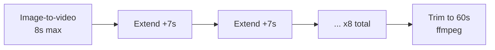

# GitHub Promo Video Plan (60s, Avatar + Veo 3.1 Fast)

Produce a ~60-second professional GitHub promo for **shopify-discord-agent** using the AI avatar as on-screen host, the authored script in `scenes.json`, and Vertex AI Veo 3.1 Fast (1080p, max initial duration + chained extend calls) via authenticated gcloud.

All paths in this plan are relative to `shopify-discord-agent/`.

## Model stack

| Role | Model | Why |
|------|-------|-----|
| **Video generation** | `veo-3.1-fast-generate-001` on Vertex AI | Image-to-video, native audio/dialogue, **8s max initial**, **+7s per extend** |
| **Script + prompt QA** | `gemini-2.5-flash` (Vertex, `us-central1`) | Optional post-render review |

Omni Flash does not expose the Veo extend API. All footage uses Veo 3.1 Fast at **1080p** (highest quality on the Fast SKU).

## Duration math



- **Initial clip:** `durationSeconds: 8`
- **Each extend:** +7 seconds
- **Chain:** 1 initial + 8 extends = **64s** raw → trim to **60.0s**
- **Extend input constraints:** MP4, 24fps, 720p/1080p, 16:9, 1–30s

## Files in this folder

| File | Purpose |
|------|---------|
| [`scenes.json`](scenes.json) | Machine-readable script + Veo prompts |
| [`config.json`](config.json) | GCP project, model, GCS paths, style tokens |
| [`github-publish.md`](github-publish.md) | Post-production GitHub checklist |
| [`intermediate/`](intermediate/) | Per-step raw clips |
| [`output/`](output/) | Final MP4 + thumbnail |

## Avatar assets

| Asset | Path (from repo root) |
|-------|----------------------|
| Primary first frame | `whoax-avatar-images/avatar-styled.png` |
| Likeness backup | `whoax-avatar-images/avatar-base.png` |
| Scene references | `whoax-avatar-images/09-n8n.jpg`, `05-shopify.jpg` |

**Character lock** (in every prompt — see `config.json`):

> Same professional man from the reference image, exact face and likeness, navy hoodie, confident presenter, photorealistic, clean corporate lighting, orange and teal accent highlights.

Set `personGeneration: "allow_adult"` on all generations.

## Full script

See [`scenes.json`](scenes.json) for dialogue and visual prompts. Summary:

| # | Time | Title | Type |
|---|------|-------|------|
| 1 | 0:00–0:08 | Hook | image-to-video |
| 2 | 0:08–0:15 | Problem | extend |
| 3 | 0:15–0:22 | Architecture | extend |
| 4 | 0:22–0:29 | Read tools demo | extend |
| 5 | 0:29–0:36 | Write tools demo | extend |
| 6 | 0:36–0:43 | Safety | extend |
| 7 | 0:43–0:50 | Docker quick start | extend |
| 8 | 0:50–0:57 | Tool breadth | extend |
| 9 | 0:57–1:00 | CTA | extend (trim in post) |

## Visual style

- **Aspect ratio:** `16:9`
- **Resolution:** `1080p`
- **FPS:** 24 (normalize with ffmpeg before each extend)
- **Palette:** navy `#1a1f2e`, orange `#FF6B35`, teal `#00B4D8`
- **Negative prompt:** see `config.json`

## GCP setup

**Project:** `project-1299ef17-2cce-4839-99c`

1. Create GCS bucket: `gs://shopify-discord-promo-99c/`
2. Upload avatar: `gsutil cp ../../whoax-avatar-images/avatar-styled.png gs://shopify-discord-promo-99c/inputs/`
3. Confirm Vertex AI API + Veo quota
4. `pip install google-genai` + `ffmpeg` on PATH

```bash
export GOOGLE_CLOUD_PROJECT=project-1299ef17-2cce-4839-99c
export GOOGLE_CLOUD_LOCATION=us-central1
export GOOGLE_GENAI_USE_VERTEXAI=true
```

Auth: gcloud CLI (already authenticated) or ADC — same pattern as `elementor-exports/banana_vertex.py`.

## Generation script (to implement)

**Path:** `scripts/generate-promo-video.py`

1. Load `promo-video/scenes.json` + `promo-video/config.json`
2. Preprocess avatar → upload to GCS
3. Scene 1: image-to-video, 8s, 1080p
4. Scenes 2–9: extend chain, save to `promo-video/intermediate/`
5. Trim to 60s → `promo-video/output/shopify-discord-agent-promo.mp4`
6. Optional QA via Gemini video review

**npm script** (add to `package.json`):

```json
"promo:video": "python scripts/generate-promo-video.py"
```

## Cost and runtime

| Step | Count | Est. each | Total |
|------|-------|-----------|-------|
| Initial 8s | 1 | 2–5 min | ~5 min |
| Extend +7s | 8 | 2–4 min | ~25 min |
| ffmpeg trim | 1 | 1 min | 1 min |
| **Total** | | | **~30–45 min** |

Budget ~$5–15 for ~64s generated.

## Risk mitigations

| Risk | Mitigation |
|------|------------|
| Face drift | Character lock phrase every scene; re-run single extend |
| Non-24fps extend reject | `ffmpeg -r 24` normalize before upload |
| Dialogue mismatch | Tighten dialogue in extend prompt; acceptable for promo |
| RAI filter | `allow_adult`; corporate avatar only |
| Large file for GitHub | Release asset or `ffmpeg -crf 23` |

## Deliverables checklist

- [x] `promo-video/PLAN.md` — this document
- [x] `promo-video/scenes.json` — scene manifest
- [x] `promo-video/config.json` — generation settings
- [x] `promo-video/github-publish.md` — publish checklist
- [ ] `scripts/generate-promo-video.py` — Veo automation
- [ ] `promo-video/output/shopify-discord-agent-promo.mp4` — final video
- [ ] README demo section + GitHub repo description